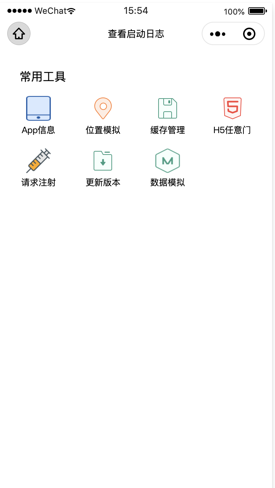
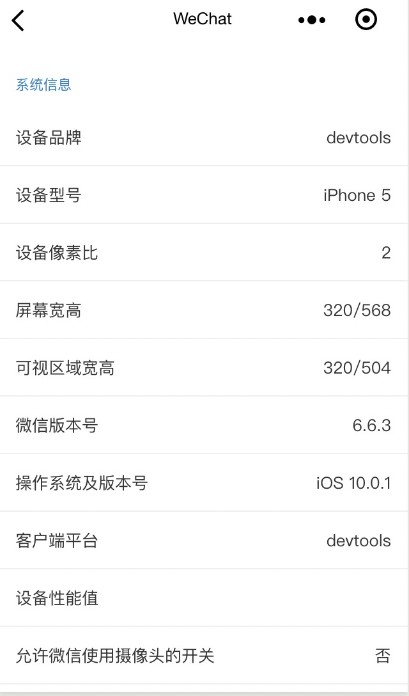
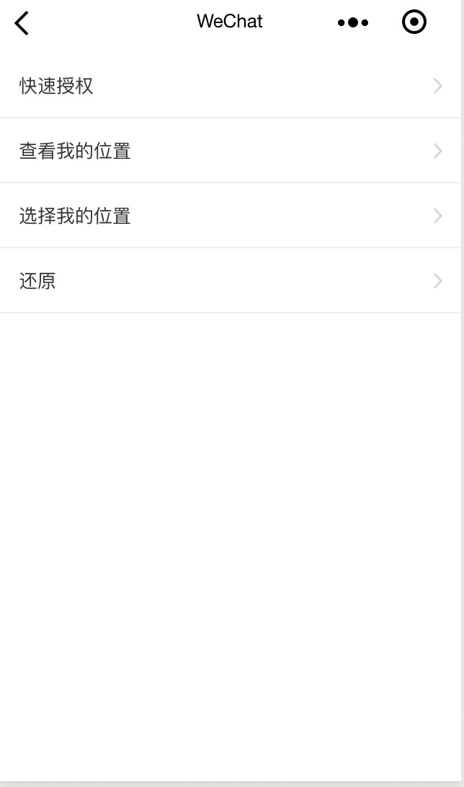
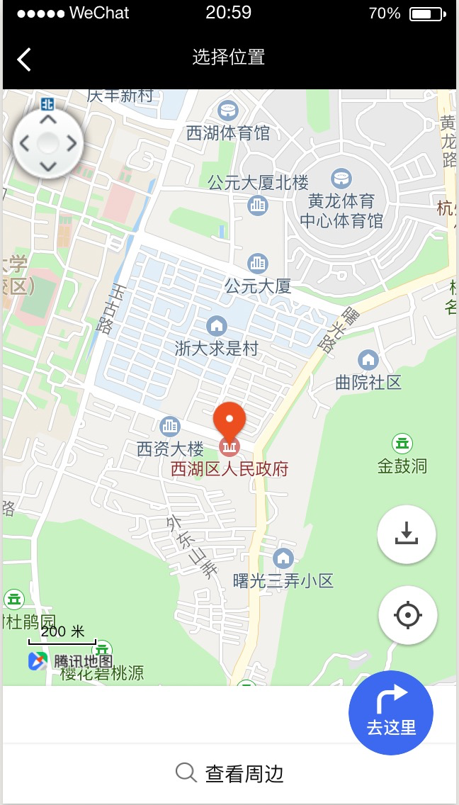
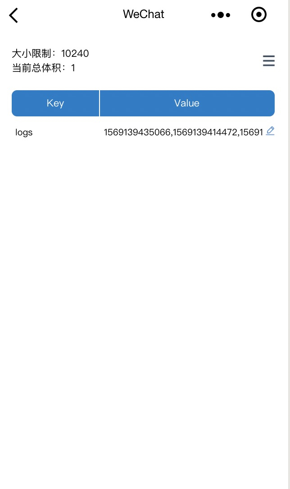
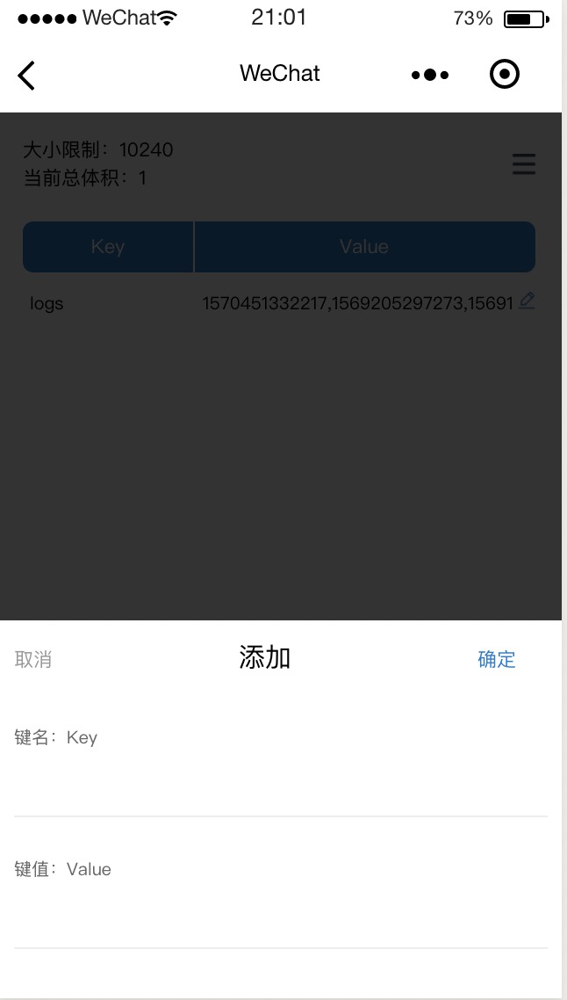
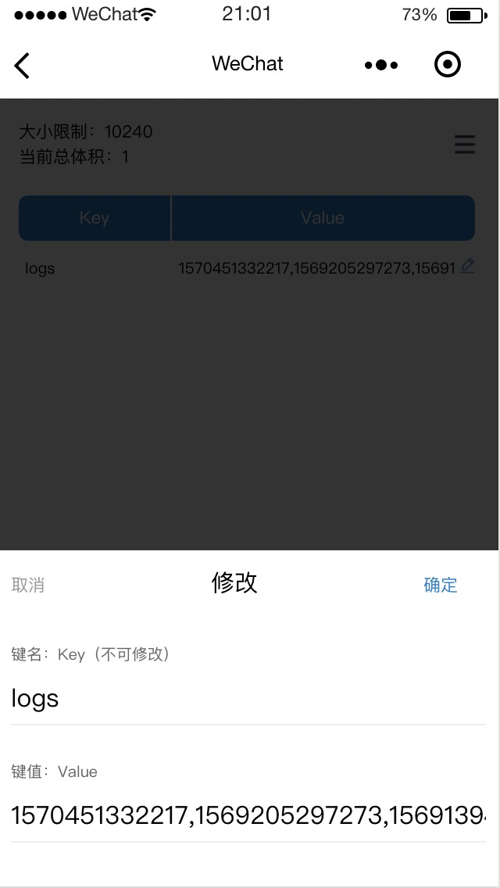

<p align="center">
    
</p>

# Doraemon mini program debugger
一个支持小程序端的调试工具
## 开发背景
对于小程序开发者和测试同学来说，很多临时性的调试功能需要单独开发去支持，比如查看小程序信息，手机信息
以及用户信息，扫码打开页面等。这些功能对于每个小程序都是相似的，而且遇到类似的需求时都需要进行单独开发。

我们内部通过对这些通用功能进行梳理沉淀，形成一个功能集合-哆啦A梦小程序端调试工具，以通用工具的形式开放对外，能够让每个小程序
都可以快速的接入这些通用并且与业务代码无关的功能，如H5任意门，小程序基本信息，位置模拟等等。

## 简单总结

Doraemon小程序端调试工具，内置很多常用的工具，避免重复实现，一次接入，你将会拥有强大的工具集合。

## 效果演示
哆啦A梦小程序端首页效果演示<br>


## 内置功能模块

- app信息<br>
<br>
用于快速查看手机系统信息，小程序基本信息，用户信息，授权信息等基础信息，避免反复打开手机设置或者调用小程序原生api进行查看。

- 位置模拟<br>


<br>
用于小程序端位置模拟，包括位置授权，位置查看，位置模拟，恢复位置设置等几大功能，可以通过简单的点击操作实现任意位置模拟和位置还原，
该功能的实现原理是通过对wx.getLocation进行方法重写，进而进行位置模拟，位置模拟后，在小程序内所有调用位置查询的方法内都将返回你设定的位置，还原后将恢复原生方法。

- 缓存管理<br>




<br>
一个强大的缓存管理面板，集成了对缓存的所有操作功能，包括设置缓存，清除缓存，更新缓存值等，可以在小程序非常便利的进行缓存管理

- H5任意门<br>
<br>
可以通过扫码和粘贴链接的方式在小程序中打开h5页面，操作简单方便

- 更新版本<br>
当你的小程序进行代码更新时，为了获取最新的线上包需要重启小程序，该功能可以在你的小程序上
通过点击更新操作，直接获取到最新的远程代码资源


# 快速上手

## 如何使用

1. 通过 `npm` 安装 `npm install --save-dev dokit-miniapp`
2. 然后从node_modules中将`dist/`目录拷贝到自己的项目中，然后按如下方式进行使用

### 在需要引用工具的页面 page.json 中引入组件

```json
"usingComponents": {
    "dokit": "../../dist/index/index"
}
```

### 在 page.wxml 中使用组件

```html
<dokit/>
```

### 在应用app.json中通过如下方式注册需要依赖的页面
 ```js
"pages": [
    "dist/appInformation/appInformation",
    "dist/debug/debug",
    "dist/h5door/h5door",
    "dist/logs/logs",
    "dist/positionSimulation/positionSimulation",
    "dist/storage/storage",
    "dist/index/index"
  ]
```
由于微信小程序暂不支持开发环境和生产环境判断，请在生产环境手动删掉引用

## 后续规划
### 性能工具（含以下功能）
    1. 小程序加载时间
    2. 首页渲染时间
    3. 进程内存展示
### 视觉工具
    1. 控件检查
    2. 接口请求性能分析
    3. 缓存文件管理器
    4. 授权开启管理工具

## 贡献

有任何意见或建议都欢迎提 issue
